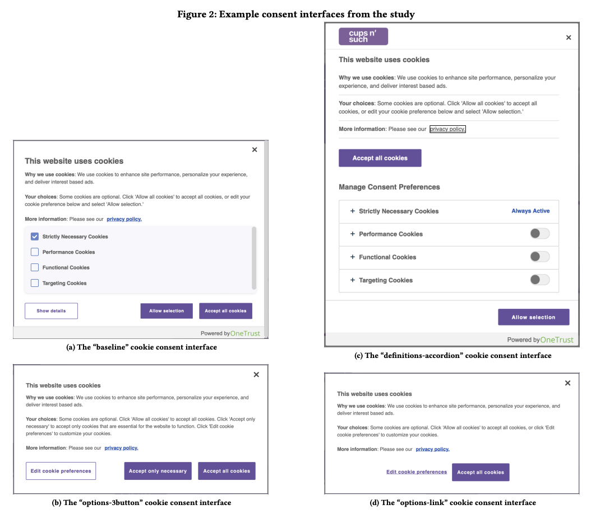

---

##### Download
+ [Paper](https://dl.acm.org/doi/full/10.1145/3544548.3580725)
+ [Presentation](https://www.cylab.cmu.edu/news/2023/05/04-cookie-consent-banners.html)
<!-- + [Papers](paper1.pdf)
+ [Online appendix](appendix1.pdf)
+ [Code and data](https://github.com/pmichaillat/feru) -->

---

##### Abstract

Websites implement cookie consent interfaces to obtain users’ permission to use non-essential cookies, as required by privacy regulations. We extend prior research evaluating the impact of interface design on cookie consent through an online behavioral experiment (n = 1359) in which we prompted mobile and desktop users from the UK and US to make cookie consent decisions using one of 14 interfaces implemented with the OneTrust consent management platform (CMP). We found significant effects on user behavior and sentiment for multiple explanatory variables, including more negative sentiment towards the consent process among UK participants and lower comprehension of interface information among mobile users. The design factor that had the largest effect on user behavior was the initial set of options displayed in the cookie banner. In addition to providing more evidence of the inadequacy of current cookie consent processes, our results have implications for website operators and CMPs.

---

<!-- ##### Figure 6: Some Uses For Olive Oil



---

##### Citation

Unterholzer, Detlev A., and  Moritz-Maria von Igelfeld. 2013. "Unusual Uses For Olive Oil." *Journal of Oleic Science* 34 (1): 449–489. http://www.alexandermccallsmith.com/book/unusual-uses-for-olive-oil.

```BibTeX
@article{UI13,
author = {Detlev A. Unterholzer and Moritz-Maria von Igelfeld},
year = {2013},
title ={Unusual Uses For Olive Oil},
journal = {Journal of Oleic Science},
volume = {34},
number = {1},
pages = {449--489},
url = {http://www.alexandermccallsmith.com/book/unusual-uses-for-olive-oil}}
```

---

##### Related material

+ [Presentation slides](presentation1.pdf)
+ [Summary of the paper](https://www.penguinrandomhouse.com/books/110403/unusual-uses-for-olive-oil-by-alexander-mccall-smith/) -->
