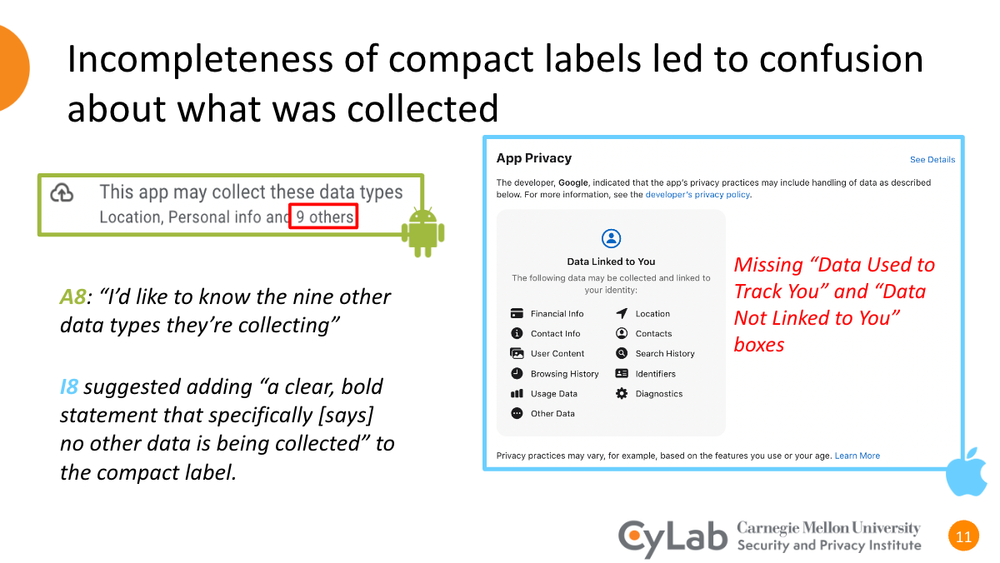

---

##### Download

+ [Paper](https://petsymposium.org/popets/2024/popets-2024-0047.php)
<!-- + [Online appendix](appendix2.pdf)
+ [Code and data](https://github.com/pmichaillat/wunk) -->

---

##### Abstract

Privacy labels---standardized, compact representations of data collection and data use practices---are often presented as a solution to the shortcomings of privacy policies. Apple introduced mandatory privacy labels for apps in its App Store in December 2020; Google introduced mandatory labels for Android apps in July 2022. iOS app privacy labels have been evaluated and critiqued in prior work. In this work, we evaluated Android Data Safety Labels and explored how differences between the two label designs impact user comprehension and label utility. We conducted a between-subjects, semi-structured interview study with 12 Android users and 12 iOS users. While some users found Android Data Safety Labels informative and helpful, other users found them too vague. Compared to iOS App Privacy Labels, Android users found the distinction between data collection groups more intuitive and found explicit inclusion of omitted data collection groups more salient. However, some users expressed skepticism regarding elided information about collected data type categories. Most users missed critical information due to not expanding the accordion interface, and they were surprised by collection practices excluded from Android's definitions. Our findings also revealed that Android users generally appreciated information about security practices included in the labels, and iOS users wanted that information added.

---

<!-- ##### Figure 2: Dimensions of a sausage dog



---

##### Citation

Prinzel, Florianus, and Moritz-Maria von Igelfeld. 2004. "The Finer Points of Sausage Dogs." *Journal of Canine Science* 43 (2): 89–109. http://www.alexandermccallsmith.com/book/the-finer-points-of-sausage-dogs.

```BibTeX
@article{PI04,
author = {Florianus Prinzel and Moritz-Maria von Igelfeld},
year = {2004},
title ={The Finer Points of Sausage Dogs},
journal = {Journal of Canine Science},
volume = {43},
number = {2},
pages = {89--109},
url = {http://www.alexandermccallsmith.com/book/the-finer-points-of-sausage-dogs}}
```

---

##### Related material

+ [Presentation slides](presentation2.pdf)
+ [Wikipedia entry](https://en.wikipedia.org/wiki/The_Finer_Points_of_Sausage_Dogs) -->
